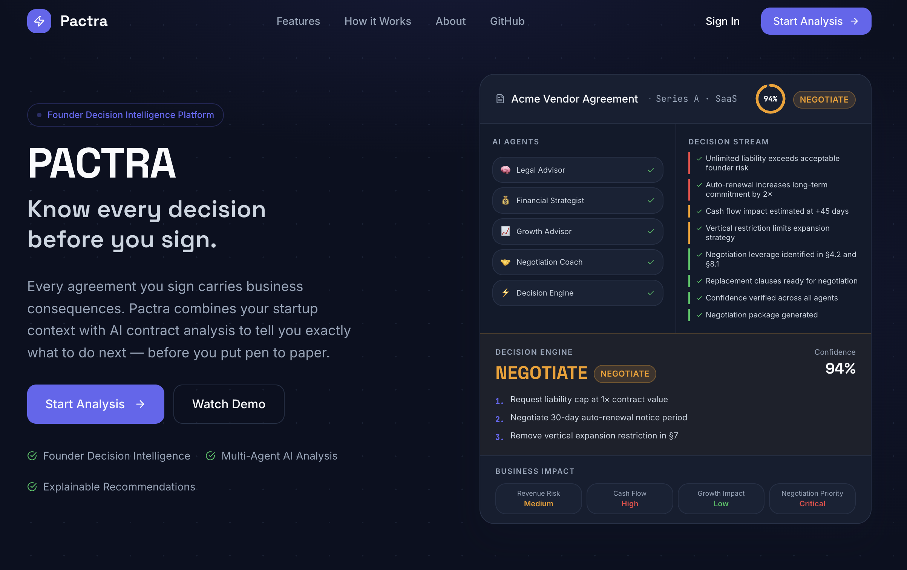
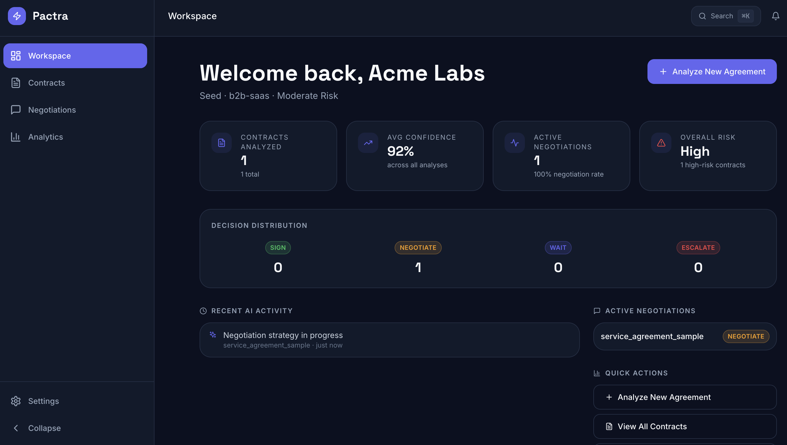
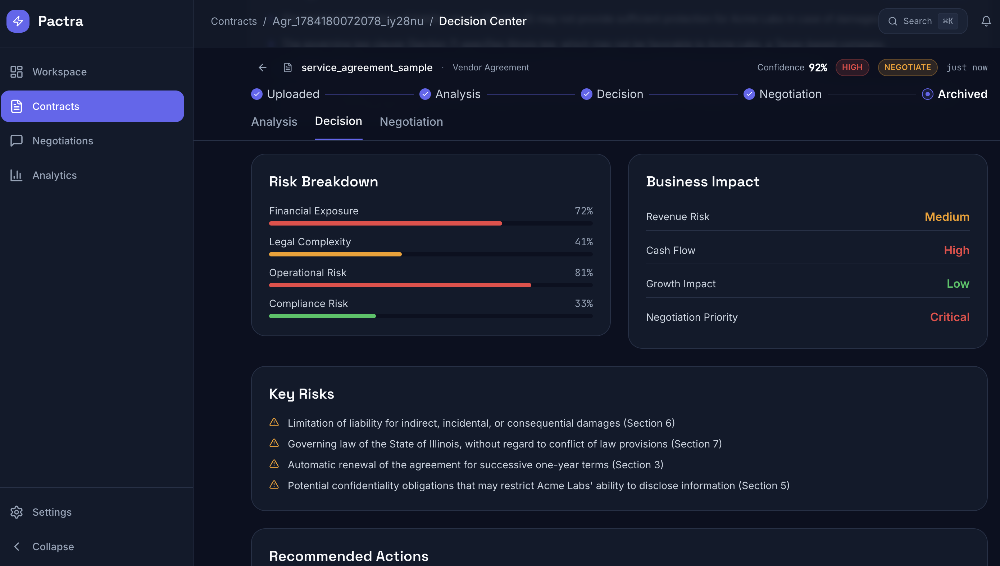
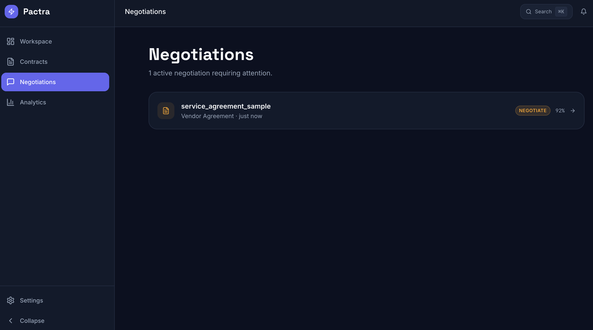
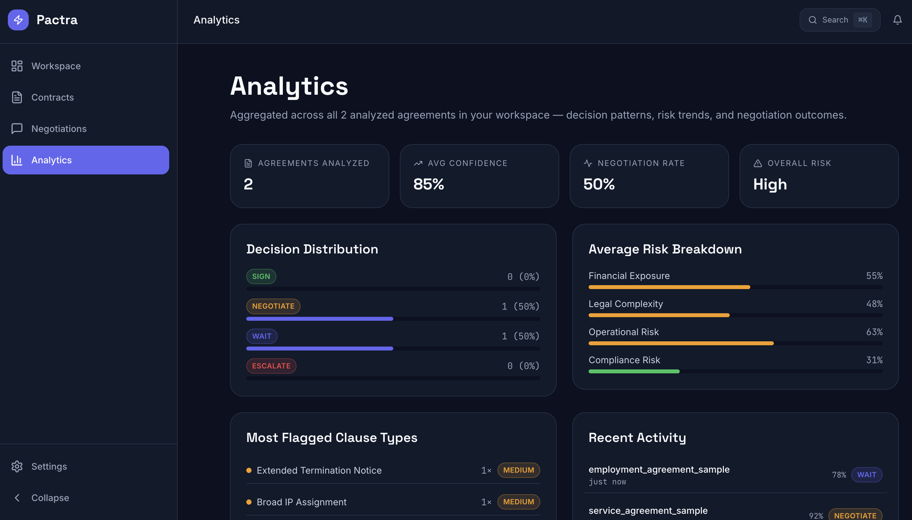

<div align="center">

# Pactra

### AI-Powered Founder Decision Intelligence Platform

**Know every business decision before you sign.**

> **Business Context + Contract Intelligence = Decision Intelligence**



🌐 **[Live Demo](https://pactra-ai-project.vercel.app/)** &nbsp;&nbsp;•&nbsp;&nbsp;
🎥 **Demo Video** *(Coming Soon)* &nbsp;&nbsp;•&nbsp;&nbsp;
📄 **[Documentation](./docs)** &nbsp;&nbsp;•&nbsp;&nbsp;
⭐ **[GitHub Repository](https://github.com/techAsmita/Pactra-AI-Project)**

<br>

🧠 Multi-Agent Decision Intelligence &nbsp;&nbsp;|&nbsp;&nbsp;
📄 PDF & DOCX Contract Analysis &nbsp;&nbsp;|&nbsp;&nbsp;
🤝 Founder-Centric Negotiation Guidance

</div>

---

# The Problem

Startup founders sign agreements every week—vendor contracts, employment agreements, NDAs, SaaS subscriptions, partnership deals—often without access to an in-house legal team.

Existing AI tools summarize contracts or simplify legal language, but they rarely answer the questions founders actually care about:

- Should I sign this agreement?
- Should I negotiate instead?
- Which clauses are risky for my business?
- What should I do next?

Understanding a contract is helpful.

**Making the right business decision is what actually matters.**

---

# The Solution

Pactra transforms contract review into **decision intelligence**.

Instead of only explaining legal text, Pactra combines your startup's business context with contract intelligence to recommend one clear action:

- ✅ Sign
- 🤝 Negotiate
- ⏳ Wait
- 🚨 Escalate

Every recommendation is personalized using your company's:

- Industry
- Funding stage
- Risk appetite
- Current business goals

When negotiation is recommended, Pactra automatically prepares a negotiation strategy and draft email to help founders move faster.

---

# Product

| Workspace | Decision Center |
|-----------|----------------|
|  |  |

| Negotiation Hub | Analytics |
|-----------------|-----------|
|  |  |

---

# Live Demo

🌐 **Application**

https://pactra-ai-project.vercel.app/

🎥 **Demo Video**

*(Add YouTube or Drive link here)*

---

# Key Features

### 🧠 Founder Context

A single founder profile powers every recommendation across the application.

- Industry
- Funding stage
- Risk appetite
- Company goals

---

### ⚖️ Contract Intelligence

Analyze PDF and DOCX agreements with clause detection, severity scoring, and business impact assessment.

---

### 📈 Decision Engine

Receive one clear recommendation:

- Sign
- Negotiate
- Wait
- Escalate

along with confidence scores, business impact, risk breakdown, and an explainable "Why this recommendation?" summary.

---

### 🤝 Negotiation Hub

For negotiation-worthy agreements Pactra automatically prepares:

- Priority clauses
- Suggested revisions
- Talking points
- Ready-to-send email draft

---

### 📊 Analytics Dashboard

Track portfolio-wide insights including:

- Decision distribution
- Risk trends
- Clause frequency
- Negotiation rate
- Overall agreement health

---

### 🔍 Global Search

Search agreements, clauses, risks, decisions, and founder information instantly through a unified command palette.

---

# Why Pactra?

| | Traditional Contract AI | Pactra |
|---|---|---|
| Primary Output | Contract Summary | Business Decision |
| Personalization | Generic | Founder-specific |
| Business Context | Limited | Fully integrated |
| Next Action | User decides | Recommended automatically |
| Negotiation Support | Usually absent | Built-in |

**Traditional AI explains contracts.**

**Pactra helps founders decide what to do next.**

---

# System Architecture

```
Founder Profile
        │
        ▼
Business Context Engine
        │
        ▼
Contract Parsing
(PDF / DOCX)
        │
        ▼
Risk & Clause Analysis
        │
        ▼
Multi-Agent Intelligence
 • Legal
 • Financial
 • Growth
 • Negotiation
        │
        ▼
Decision Engine
SIGN • NEGOTIATE • WAIT • ESCALATE
        │
        ▼
Negotiation Strategy
        │
        ▼
Workspace Analytics
```

---

# AI Architecture

Pactra follows a hybrid decision pipeline.

### Deterministic Layer

Responsible for:

- Decision classification
- Confidence score
- Risk scoring
- Business impact

This ensures predictable, reproducible recommendations.

---

### LLM Reasoning Layer

Powered by **Groq (`llama-3.3-70b-versatile`)**

Responsible for:

- Plain-language explanation
- Why this recommendation?
- Key risks
- Opportunities
- Negotiation reasoning

The model is accessed through a secure Vercel Serverless Function so API keys never reach the client.

If the AI service is unavailable, Pactra automatically falls back to simulated reasoning so the experience never breaks.

---

# Technology Stack

| Layer | Technology |
|------|------------|
| Frontend | React + TypeScript + Vite |
| Styling | Tailwind CSS |
| Animations | Framer Motion |
| Icons | Lucide React |
| Document Parsing | PDF.js + Mammoth |
| AI | Groq (Llama 3.3 70B Versatile) |
| State Management | React Context + sessionStorage |
| Deployment | Vercel |

---

# Getting Started

```bash
git clone https://github.com/techAsmita/Pactra-AI-Project.git

cd Pactra/frontend

npm install

npm run dev
```

Open:

```
http://localhost:5173
```

Build for production:

```bash
npm run build
```

---

# Project Structure

```
Pactra
│
├── docs
│   ├── screenshots
│   ├── Product Vision
│   ├── Information Architecture
│   ├── Design System
│   ├── Component Library
│   └── Decision Flows
│
├── frontend
│
├── backend (planned)
│
├── database (planned)
│
└── architecture
```

---

# Documentation

- Product Vision
- Information Architecture
- Design System
- Component Library
- Decision Flows

---

# Roadmap

### Current Version

- Complete founder workflow
- Interactive multi-page product
- AI-assisted reasoning
- Negotiation workspace
- Analytics dashboard
- Live deployment

### Future Work

- FastAPI backend
- Persistent database
- Authentication
- Multi-user workspaces
- Advanced AI clause extraction
- Enterprise integrations

---

# Built For

Founders who need to make confident business decisions—before they sign the next agreement.

---

<div align="center">

### ⭐ If you found Pactra interesting, consider giving the repository a star.

Built with ❤️ for founders who move fast and sign smart.

</div>